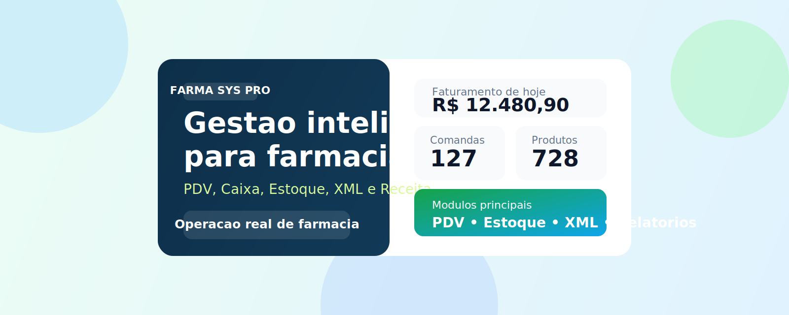
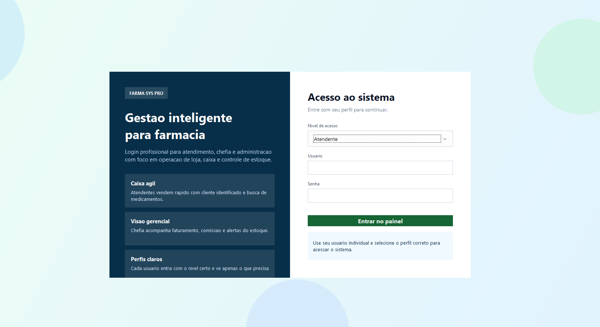
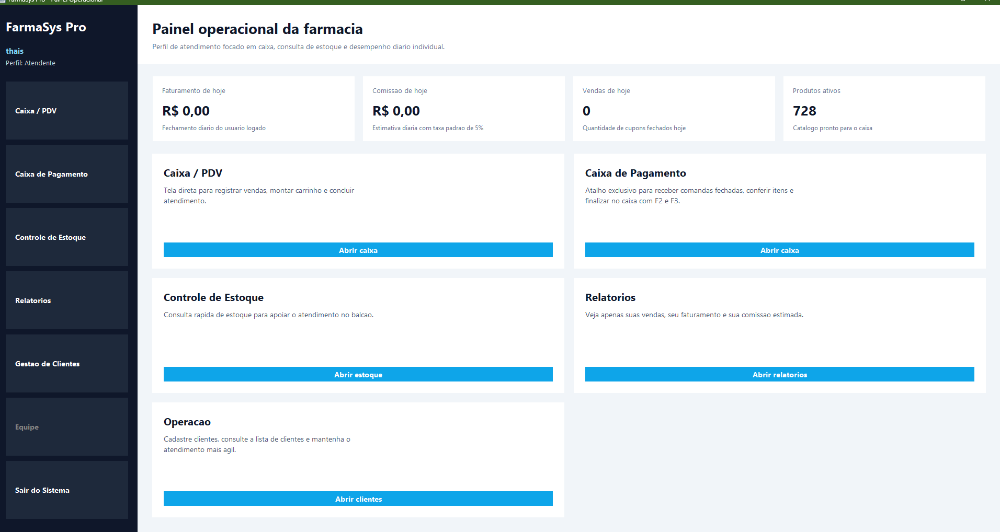
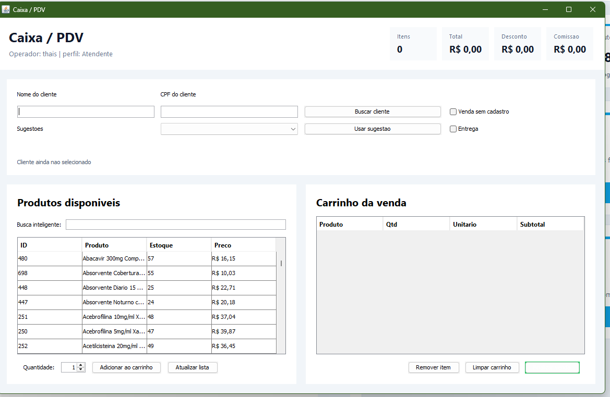
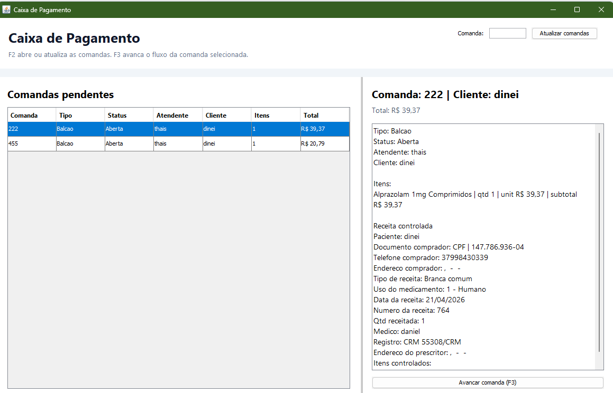
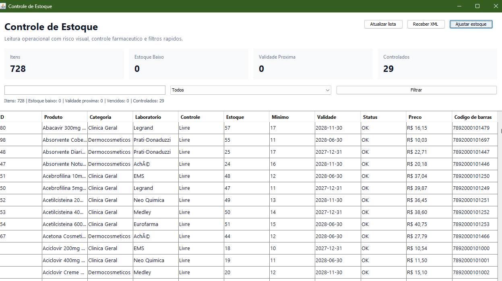
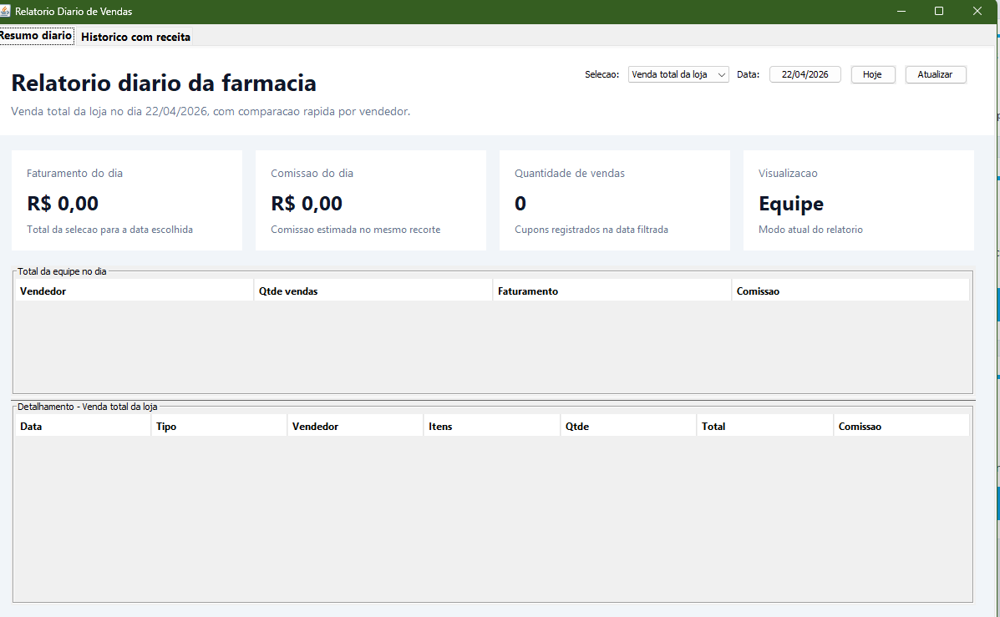

# FarmaSys Pro

Sistema desktop para operacao de farmacia, desenvolvido em Java Swing com SQLite, focado em rotinas reais de balcao, caixa, estoque, entrega, recebimento por XML e acompanhamento gerencial.



> Sistema desktop para gestao operacional de farmacia com foco em atendimento, caixa, estoque, XML e controle de receita.

## Destaques rapidos

- `Java 17 + Swing + SQLite`
- `PDV com comanda e caixa separado`
- `Recebimento de estoque por XML`
- `Fluxo de entrega`
- `Historico com receita`
- `Relatorios diarios por loja e usuario`

## Links de apoio

- [Portfolio do projeto](docs/PORTFOLIO.md)
- [Textos para LinkedIn e curriculo](docs/LINKEDIN_E_CV.md)
- [Roteiro de apresentacao](docs/APRESENTACAO.md)
- [Guia de publicacao](docs/PUBLICACAO.md)
- [Video demo completo](docs/demo/farmasys-pro-demo-completa.mp4)

## Galeria

### Login



### Painel principal



### Caixa / PDV



### Caixa de pagamento



### Controle de estoque



### Relatorios



## Demonstracao em video

O projeto possui uma demonstracao completa em video, recomendada para:

- portfolio pessoal
- post no LinkedIn
- anexo em GitHub Releases
- apresentacao em entrevista

Link da demonstracao:

- [Video e materiais no Google Drive](https://drive.google.com/drive/folders/1aswfpxs0vLELtJH_ElSkmd0-CFVXBOnr?usp=drive_link)

Sugestao de uso do video:

- publicar junto com o repositrio no GitHub
- usar como apoio no portfolio pessoal
- anexar no LinkedIn ou apresentar em entrevista

## Visao geral

O FarmaSys Pro foi pensado para simular um ambiente de farmacia com fluxo operacional mais proximo do uso real. O sistema separa perfis de acesso, organiza o trabalho entre atendente, caixa, chefia e administracao, e centraliza processos como venda, controle de estoque, historico com receita e recebimento de mercadoria por XML.

O projeto evoluiu para um produto de escritorio com foco em:

- rapidez no atendimento
- leitura operacional clara
- fluxo de caixa com comanda
- rastreabilidade de receitas e medicamentos controlados
- controle de entrada e saida de estoque
- visao diaria para gestao

## Principais funcionalidades

### Login e perfis

- Login com niveis de acesso para `Atendente`, `Chefe` e `Administrador`
- Home operacional com painel visual por perfil
- Usuario aceito com maiusculas ou minusculas

### Caixa / PDV

- Busca inteligente de clientes por nome ou CPF
- Opcao de venda com cadastro ou venda sem cadastro
- Busca inteligente de medicamentos
- Carrinho com calculo de subtotal, desconto e comissao
- Fluxo de entrega com endereco, bairro, cidade e taxa de entrega
- Finalizacao por comanda numerica de `001` a `999`

### Caixa de pagamento

- Tela exclusiva para operador de caixa
- Consulta de comandas pendentes
- Conferencia dos itens vendidos antes do pagamento
- Pagamento com multiplas formas:
  - Dinheiro
  - Pix
  - Cartao de debito
  - Cartao de credito
  - Parcelamentos
  - Convenio
  - Outros
- Atalhos de teclado com `F2`, `F3` e `Esc`

### Controle de estoque

- Catalogo grande com centenas de itens
- Medicamentos, perfumaria, higiene, infantil e dermocosmeticos
- Busca inteligente
- Visualizacao de estoque, minimo, validade, preco e codigo de barras
- Ajuste de estoque com opcoes de definir saldo, adicionar e retirar
- Entrada automatica por XML de nota fiscal

### Recebimento por XML

- Leitura de XML da NF-e
- Busca inteligente de distribuidora por nome ou CNPJ
- Cadastro de distribuidoras
- Conferencia dos itens da nota antes do lancamento
- Atualizacao de lote, validade, laboratorio e custo
- Cadastro automatico de produtos novos quando vierem no XML
- Bloqueio de itens sem codigo de barras
- Regra para somar estoque sem duplicar produto quando o nome coincide e o codigo de barras da nota vier diferente

### Receitas e medicamentos controlados

- Identificacao de medicamentos controlados e antibioticos
- Tela de preenchimento de receita antes da conclusao da venda
- Busca inteligente de medico por nome e numero de registro
- Cadastro de medicos
- Tipos de registro como `CRM`, `CRO`, `RMS`, `RQE` e outros
- Sugestao automatica de tipo de receituario conforme medicamento
- Historico com visualizacao de vendas com receita

### Relatorios

- Relatorio diario da loja
- Venda total da loja
- Venda por usuario
- Entrega por usuario
- Calendario compacto para trocar o dia consultado
- Historico com receita acessivel aos perfis

## Diferenciais do projeto

- Interface desktop desenhada para parecer sistema real de farmacia
- Operacao separada entre vendedor e operador de caixa
- Fluxo de comanda para controlar fechamento de venda
- Controle de entrega com status operacional
- Registro de receita para itens que exigem prescricao
- Entrada de produtos por XML de nota fiscal
- Painel com foco em faturamento diario

## Stack utilizada

- `Java 17`
- `Swing`
- `SQLite`
- `Maven`
- `sqlite-jdbc`

## Estrutura do projeto

```text
src/main/java/com/farmacia
├── dao
├── model
├── util
└── view
```

Arquivos importantes:

- [LoginView.java](C:/Users/widin/Downloads/screenmatch%20(1)/FarmaciaSistema/src/main/java/com/farmacia/view/LoginView.java)
- [MenuView.java](C:/Users/widin/Downloads/screenmatch%20(1)/FarmaciaSistema/src/main/java/com/farmacia/view/MenuView.java)
- [VendaView.java](C:/Users/widin/Downloads/screenmatch%20(1)/FarmaciaSistema/src/main/java/com/farmacia/view/VendaView.java)
- [CaixaPagamentoView.java](C:/Users/widin/Downloads/screenmatch%20(1)/FarmaciaSistema/src/main/java/com/farmacia/view/CaixaPagamentoView.java)
- [EstoqueView.java](C:/Users/widin/Downloads/screenmatch%20(1)/FarmaciaSistema/src/main/java/com/farmacia/view/EstoqueView.java)
- [RecebimentoEstoqueXmlView.java](C:/Users/widin/Downloads/screenmatch%20(1)/FarmaciaSistema/src/main/java/com/farmacia/view/RecebimentoEstoqueXmlView.java)
- [RelatorioFinanceiroView.java](C:/Users/widin/Downloads/screenmatch%20(1)/FarmaciaSistema/src/main/java/com/farmacia/view/RelatorioFinanceiroView.java)
- [ConnectionFactory.java](C:/Users/widin/Downloads/screenmatch%20(1)/FarmaciaSistema/src/main/java/com/farmacia/util/ConnectionFactory.java)

## Como executar

### Opcao rapida

No Windows, basta executar:

```bat
run-app.bat
```

### Opcao Maven

```bash
mvn clean compile
mvn exec:java -Dexec.mainClass="com.farmacia.view.LoginView"
```

## Fluxo de uso

### Atendente

1. Faz login no sistema
2. Busca ou cadastra cliente
3. Monta o carrinho no PDV
4. Finaliza a venda gerando comanda
5. Se houver controlado ou antibiotico, preenche os dados da receita

### Caixa

1. Abre a tela de caixa de pagamento
2. Busca a comanda
3. Confere os medicamentos vendidos
4. Registra a forma de pagamento
5. Fecha a comanda e conclui a venda

### Chefia / Administracao

1. Consulta o painel diario
2. Acompanha relatorios de venda
3. Analisa desempenho por usuario
4. Recebe mercadorias por XML
5. Monitora estoque, controlados e historico com receita

## Pontos fortes para portfolio

- Simula um produto comercial completo, e nao apenas um CRUD simples
- Resolve problemas reais de farmacia, com regras de negocio especificas
- Mostra dominio de interface desktop, persistencia local, modelagem e fluxo operacional
- Tem foco claro em usabilidade, perfis de acesso e experiencia do operador

## Como apresentar este projeto

Se for publicar no GitHub, portfolio pessoal ou LinkedIn, a melhor narrativa e:

1. Comecar pela tela de login e explicar os perfis
2. Mostrar o painel operacional com foco no dia atual
3. Demonstrar a venda no PDV e a geracao de comanda
4. Mostrar o caixa separado para fechar a venda
5. Exibir o controle de estoque e o recebimento por XML
6. Fechar com relatorios e historico com receita

Os materiais de apoio para apresentar o projeto estao em:

- [Portfolio](docs/PORTFOLIO.md)
- [Textos para LinkedIn e curriculo](docs/LINKEDIN_E_CV.md)
- [Roteiro de apresentacao](docs/APRESENTACAO.md)
- [Guia de publicacao](docs/PUBLICACAO.md)
- [Demo no Google Drive](https://drive.google.com/drive/folders/1aswfpxs0vLELtJH_ElSkmd0-CFVXBOnr?usp=sharing)

## Melhorias futuras

- Exportacao de relatorios
- Dashboard com graficos
- Cadastro de convenios e operadoras
- Impressao de comprovantes e etiquetas
- Controle de caixa por turno
- Integracao com impressora termica e leitor de codigo de barras

## Observacao tecnica

O projeto utiliza SQLite local, com criacao automatica da estrutura ao iniciar. Em alguns ambientes com Java 25 podem aparecer avisos do `sqlite-jdbc`, mas a aplicacao continua executando normalmente.
